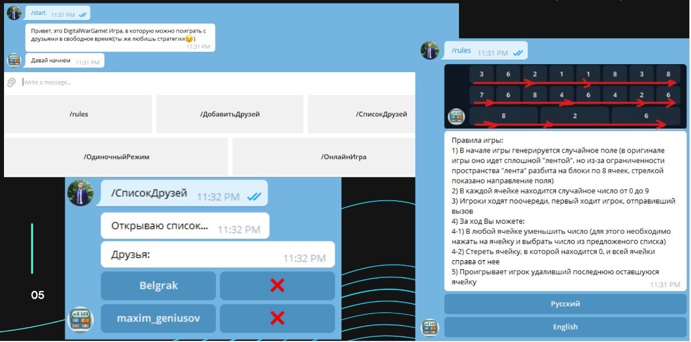
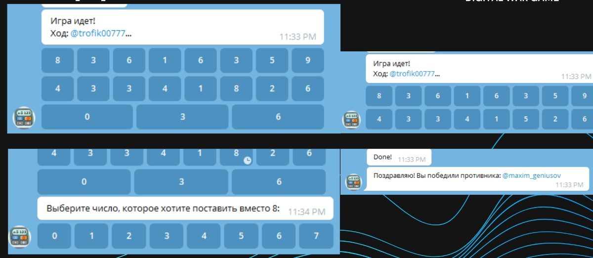

# TgBotDigitalWarGame_public

## About

Mini online strategy game for Telegram. With the possibility of playing online.

The application is implemented in the Python 3.9 programming language, using the Telegram API and the Google Translate API. A database is used to store data about users and battles. Sqlite is selected as the DBMS.

## Run

Insert the `token` of your telegram bot into the program and launch the application

## Rules

1. At the beginning of the game, a random field is generated (in the original game, it goes in a solid "ribbon", but due to the limited space, the "ribbon" is divided into blocks of 8 cells)
2. Each cell contains a random number from 0 to 9
3. The players take turns, the player who sent the call goes first
4. Per turn you can:
    1. In any cell, reduce the number (to do this, click on the cell and select a number from the suggested list)
    2. Erase the cell containing 0 and the entire cell to the right of it
5. The player who deleted the last remaining cell loses

## Screenshots

## More Info

For more information you can watch presentation and .docx file
